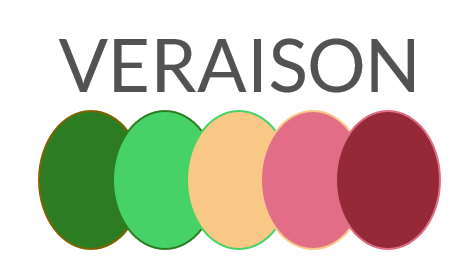

<!--
  -- Copyright 2020 Contributors to the Veraison project.
  -- SPDX-License-Identifier: Apache-2.0
--->

# Welcome To VERAISON

Project _VERAISON_: **VER**ific**A**t**I**on of atte**S**tati**ON**

  

## Briefly...
Project Veraison builds software components that can be used to build an Attestation Verification Service.

## Background
Attestation is the system by which something produces evidence about itself that another party can use to evaluate the trustworthiness of that entity. A critical part of establishing trust based on that evidence is Verifying what is presented to ensure it meets a policy established to prove trustworthiness. The act of Verification will often require comparing evidence against reference values or checking cryptographic signing by a known trust anchors. This is a complex task to be performed by an arbitrary user of a system and it is often delegated to a trusted Verification Service instead. The nature of the Service will depend upon the deployment - it may be a local software component or it may reside as a network or internet accessible component. The actual nature of the Service will depend upon the actual deployment. The Verification Service will need up to date data for the process of appraising the evidence presented to it. This must be obtained from authoritative sources, which normally implies establishing business relationships between the Verification Service and those sources. 

## What part does Veraison play in this?
Given the above, it can be challenging to build just one Verification Service solution which can address all deployments for a technology that needs to produce Attestation reports to prove its trustworthiness. If that then implies that each deployment needs a custom service, there is a significant software barrier and hence cost of entry to establishing a system that can be used in a secure manner. Veraison aims to provide consistency and convenience to solving this problem by building the software components that can be used to build Attestation Verification Services. The Veraison project will also build some reference implementations in order to prove the integration principles of those components and to provide a convenient starting point for some implementations.

For further details, see the work in progress documentation under [docs](docs)

## Why "Veraison"?
Veraison ("ver-ayy-son") is a term used in winemaking to indicate the point at which grapes start to ripen. 
It was chosen for this project mainly because it could fit into the project intent (verification of attestation) and because it didn't clash with any other project name.
There is also an allegorical aspect about good/bad verifications being reflected by ripe / unripe states or even common uses of green / red colours, but musing on such interpretations is left to the reader! 

# Maintainers

VERAISON is a collaborative project. The current list of the individuals and organizations who maintain this project can be found [**here**](./MAINTAINERS.toml). 

# Contributing
We welcome contributions to Veraison. See [Contributing](./CONTRIBUTING.md) for more details. 

# Code of Conduct
The project applies a Code of Conduct adapted from the Contributor Covenent. See [Code of Conduct](./CODE_OF_CONDUCT.md) for further details.

# Community

The VERAISON community is just starting to evolve. A public meeting is held weekly to discuss the project progress and plans. All are welcome.
The meetings are held at 16:00 UK GMT/BST every Tuesday.

The Meetings are held on Zoom: [Click on this meeting link to join](https://armltd.zoom.us/j/93024860563?pwd=dVpVcFRtSVFmV29HV3dHWENrZk5WQT09)
Meeting ID: 930 2486 0563
Passcode: 535948

To start a conversation on any topic to do with the project, visit https://veraison.zulipchat.com

# License

The software is provided under Apache-2.0. Contributions to this project are accepted under the same license.

